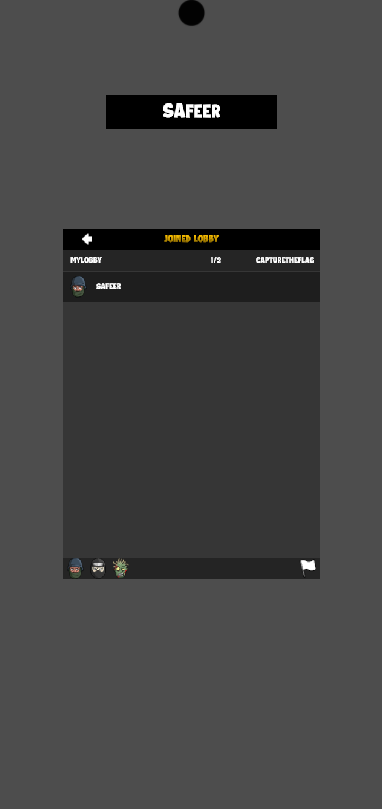
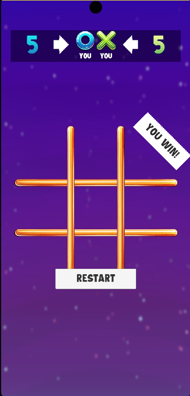

# 🎮 Tic Tac Toe Multiplayer - Unity Netcode for GameObjects


A simple yet functional **Tic Tac Toe** game built in **Unity** using **Netcode for GameObjects**. Play with friends across the network with smooth synchronization and modern UI.

---

## 🚀 Features

- 🔁 Turn-based multiplayer over the network
- ⚙️ Built with Unity's official Netcode for GameObjects
- 🎨 Clean and responsive UI
- 🔄 Automatic turn switching
- 📱 Easy to extend for mobile or web builds

---

## 📸 Screenshots

| Lobby Scene | Gameplay Scene |
|-------------|----------------|
|  |  |

---

## 🧩 Tech Stack

- **Unity** (2022 or later recommended)
- **Netcode for GameObjects** (NGO)
- **Unity Transport (UTP)**
- Optional: Unity Relay for NAT traversal (for remote players)

---

## 🛠️ How to Run

1. Clone this repository:
   ```bash
   git clone https://github.com/yourusername/TicTacToeMultiplayer.git
   ```

2. Open in Unity Hub (compatible with Unity 2022.3+)

3. Install required packages:
   - `Netcode for GameObjects`
   - `Unity Transport`
   - (Optional) `Unity Relay` if using Unity Gaming Services

4. Play in **Host** or **Client** mode from UI.

---

## 📁 Folder Structure

```
Assets/
├── Scripts/
│   ├── NetworkManagerUI.cs
│   ├── TicTacToeManager.cs
│   └── ...
├── Prefabs/
├── Scenes/
│   ├── Lobby.unity
│   └── Game.unity
└── UI/
```

---

## ✨ Future Improvements

- 🎙 Voice chat
- 📱 Mobile build
- 🧠 AI opponent (for offline)
- 🥇 Leaderboard system

---

## 👨‍💻 Author

**Safeer Ahmed Rana**  
📧 safeerrana54@gmail.com  
🌐 [Portfolio or LinkedIn link]

---

## ⭐ Star this repo if you liked it!